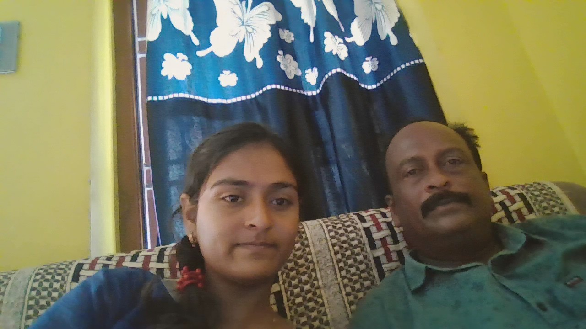

# CODSOFT2
<!DOCTYPE html>
<html lang="en">
<head>
    <meta charset="UTF-8">
    <meta name="viewport" content="width=device-width, initial-scale=1.0">
    <title>Your Name - Portfolio</title>
    <link rel="stylesheet" href="styles.css">
</head>
<body>
    <header>
        <h1>DEEPIKA</h1>
        
A passionate Full Stack Software Developer

    </header>

    <section id="about">
        
        
Hi, I'm DEEPIKA, a passionate Full Stack Software Developer with experience in building Web and Mobile applications using JavaScript, React.js, Node.js, React Native, and other cool libraries and frameworks.

    </section>

    <section id="skills">
        <h2>Skills</h2>
        <ul>
            <li>JavaScript</li>
            <li>React.js</li>
            <li>Node.js</li>
            <li>React Native</li>
        </ul>
    </section>

    <section id="projects">
        <h2>Projects</h2>
        

            <h3>Task Manager App</h3>
            
Developed a Task Manager App using React.js and Node.js. This app allows users to create, update, delete, and organize tasks efficiently. Features include user authentication, real-time updates, and a responsive design for both web and mobile platforms.

        

        

            <h3>Weather Forecast App</h3>
            
Developed a Weather Forecast App using JavaScript and React.js that provides current weather updates and a 7-day forecast for any location. Integrated with a third-party weather API to fetch and display data dynamically. Features include location search, temperature unit conversion, and a clean, user-friendly interface.

        

    </section>

    <section id="resume">
        <h2>Resume</h2>
        <a href="DEEPIKA-resume.pdf" download>Download My Resume</a>
    </section>

    <section id="contact">
        <h2>Contact</h2>
        
Email: deepikaudatha5@gmail.com.com

        
Phone: +917337298629

    </section>

    <footer>
        
&copy; 2024 DEEPIKA

    </footer>
</body>
</html>
#styles.csss
body {
    font-family: Arial, sans-serif;
    margin: 0;
    padding: 0;
    box-sizing: border-box;
}

header {
    background-color: #f4f4f4;
    text-align: center;
    padding: 2rem 0;
}

header h1 {
    margin: 0;
}

header p {
    margin: 0.5rem 0 0;
}

section {
    padding: 2rem;
}

section#about {
    text-align: center;
}

section#about img {
    border-radius: 50%;
    width: 150px;
    height: 150px;
    object-fit: cover;
}

section#skills ul {
    list-style-type: none;
    padding: 0;
}

section#skills li {
    background-color: #e4e4e4;
    display: inline-block;
    margin: 0.5rem;
    padding: 0.5rem 1rem;
    border-radius: 5px;
}

section#projects .project {
    background-color: #f9f9f9;
    margin-bottom: 1rem;
    padding: 1rem;
    border: 1px solid #e4e4e4;
    border-radius: 5px;
}

section#resume a {
    display: inline-block;
    background-color: #007BFF;
    color: #fff;
    padding: 0.5rem 1rem;
    border-radius: 5px;
    text-decoration: none;
}

section#contact p {
    margin: 0.5rem 0;
}

footer {
    text-align: center;
    background-color: #f4f4f4;
    padding: 1rem 0;
}

